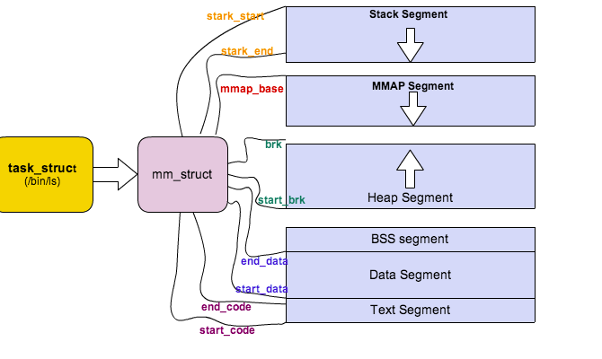

###1.为什么把进程空间分为内核空间和用户空间
因为用户程序都可以通过系统调用进入内核,共享内核空间,就没必要私有了

###2.为什么说每个进程拥有3GB的私有用户空间?
因为每个程序有自己的映射关系,所以3GB是独立的

###3.内核空间放什么内容?如何把一个虚地址转换成物理地址?
放内核代码和数据,减去PAGE_OFFSET即使物理地址,可以使用__pa宏

###4.什么是内核映像?它放在物理空间和内核空间什么地方?
内核代码和数据叫内核映像,放在物理地址0x00100000地方(1MB),也就是内核地址0xC01000000

###5.用户空间分哪及部分?malloc分配的属于哪一部分?
从高地址到低地址依次是:桟 堆 BSS 数据段 代码段 , malloc属于堆部分

###6.mm_struct描述了哪些方面?内核如何组织的?

###7.vm_area_struct描述了哪些方面?内核如何组织的?

###8.为什么把进程的用户空间划分为一个个区间?
方便管理

###10.进程用户空间何时创建?如何创建?
fork()创建了和父进程一样的用户空间

###11.什么是虚存映射?有几种?
把映像链接到用户空间就叫虚存映射 3种:共享映射 私有映射 匿名映射

###12.一个进程通常包含几个虚存区?
共享库的代码段 数据段 BSS段,程序自己的代码段 数据段 BSS段 堆栈段

###13.说明mmap()系统调用功能?写一个拷贝文件程序
将一个文件或者其它对象映射进内存。mmapp配合ftruncate即可
