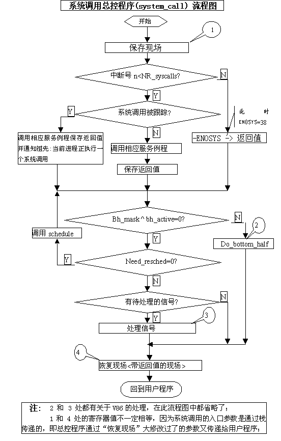
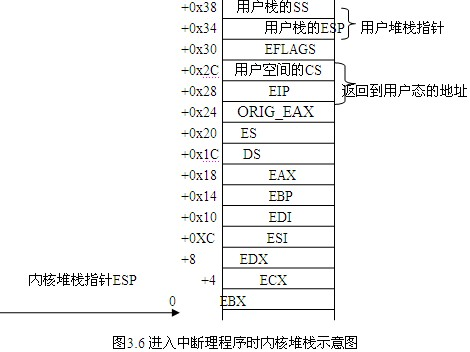

###1. 什么是系统调用，为什么引入系统调用？
系统调用：系统提供给程序的接口     为了程序在不同OS下可以编译运行

###2. 系统调用和库函数、系统命令及内核函数的区别和联系?
库函数：运行在用户态，一个库函数可能调用多个系统调用
系统命令：在更高的层次，是一个个程序，实现调用系统调用
内核函数：是系统调用的”服务例程“，系统调用是其的“封装例程”

###3. 内核为什么设置系统调用处理函数？和服务例程什么区别？
保存刚进入内核态时的寄存器值，获取一些信息，转入服务例程

###4. system_call()为什么把PCB地址放入EBX寄存器？
为了以后获取PCB信息方便

###5. 滑出system_call()流程图

###6. 说明系统调用号的作用？
用来找到对应的处理程序，并且用来检查

###7. 画出系统调用进入内核时的堆栈内容

###9. 如何封装系统调用?
采用__syscall0~5宏来封装各个例程如：

  __syscall3(int,write,int,fd,char *,buf,unsigned int,count);
  
###11.添加一个系统调用的步骤

  1. 添加系统调用号在arch/x86/include/asm/unistd_32.h和/usr/include/asm/unistd_32.h添加宏
  2. 在系统调用表添加表项arch/x86/kernel/syscall_table_32.S中
  3. 添加调用实现在sys.c中
  4. 重新编译内核
